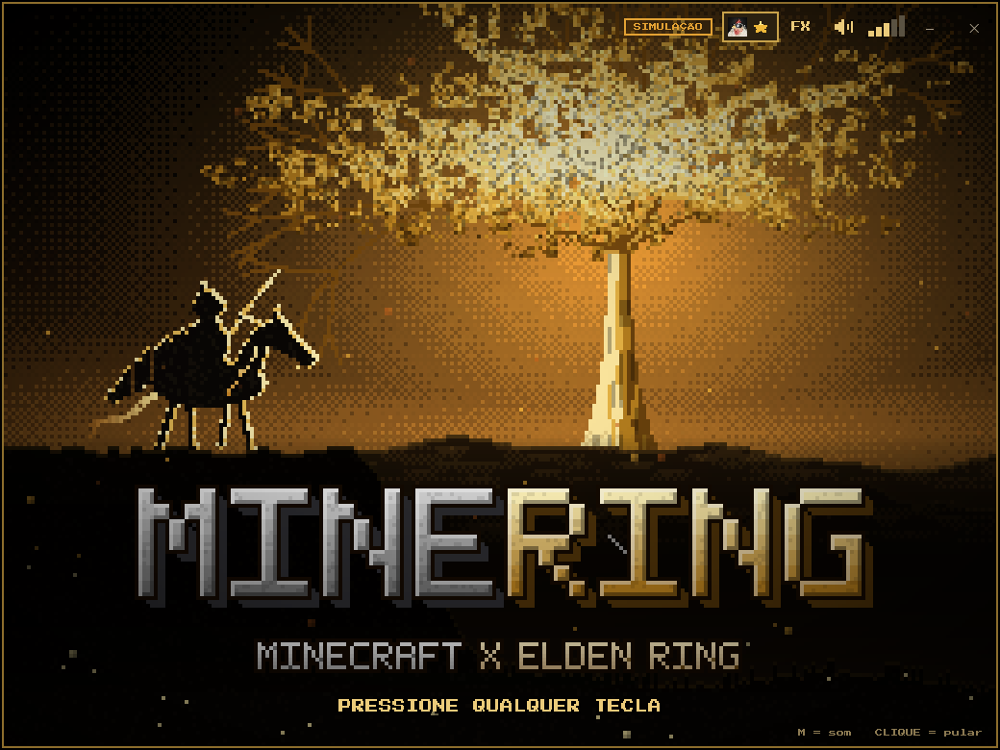
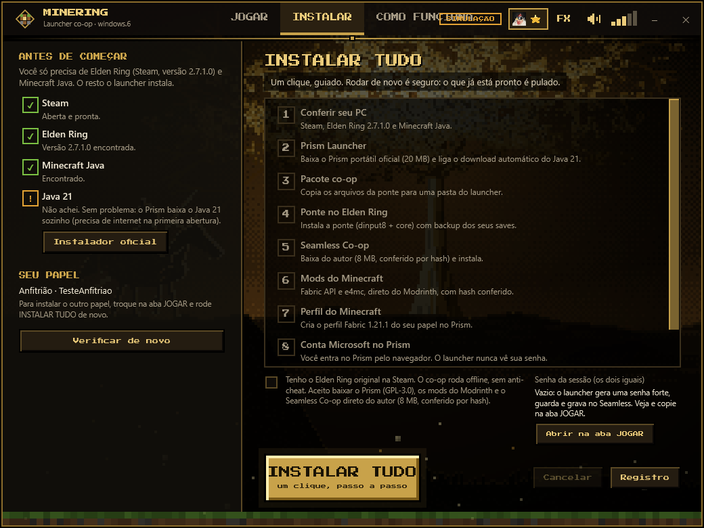
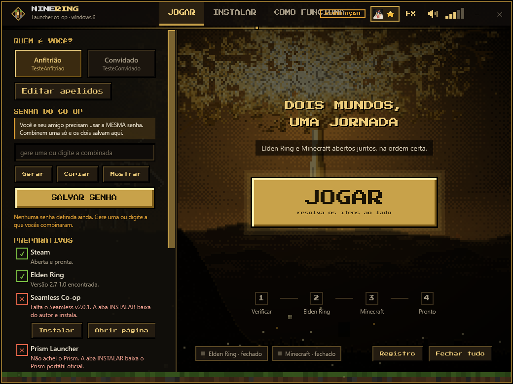
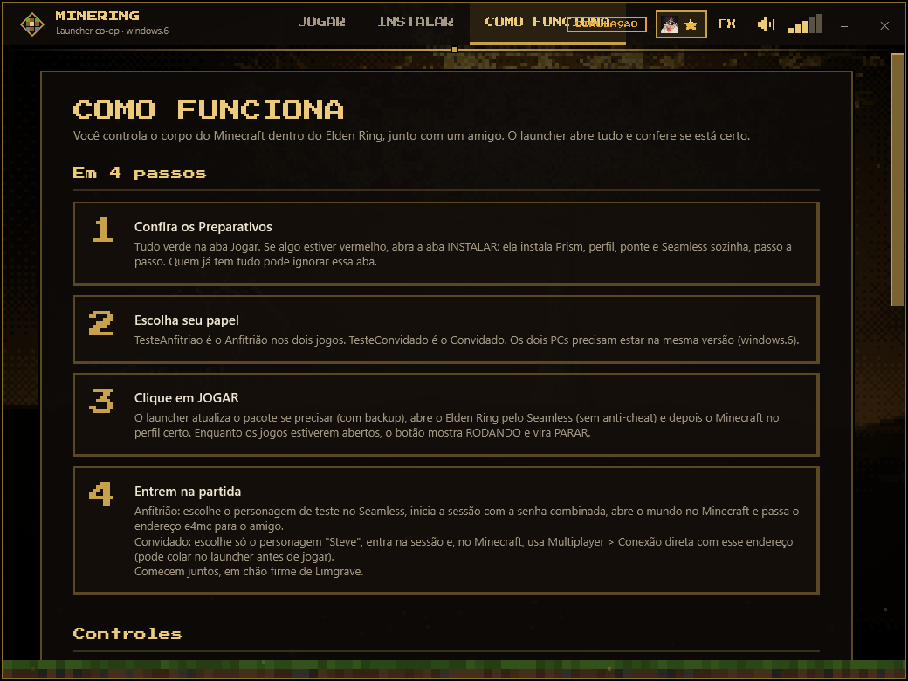

# MineRing Launcher

Launcher em pixel art para jogar **Minecraft e Elden Ring juntos**: voce controla o corpo do Minecraft dentro do Elden Ring, em co-op com um amigo. Com um clique em **JOGAR** ele confere os preparativos, atualiza o pacote da ponte (com backup), abre o Elden Ring pelo Seamless Co-op (sem anti-cheat) e depois o Minecraft no perfil certo.






## O que e

- `src/`: o launcher (WPF nativo, C#, compilado com o `csc.exe` que ja vem no Windows; nada para instalar).
- `pack/`: codigo da ponte Elden Ring <-> Minecraft (DLL nativa em C++, mod Fabric em Java) e scripts PowerShell de instalacao/atualizacao. Deriva de [justbustin/minecraft-crossover-bridge](https://github.com/justbustin/minecraft-crossover-bridge) (MIT).
- `assets/fonts/`: fonte Press Start 2P (OFL).

## Aviso importante (EAC / somente offline)

O co-op roda **sem o Easy Anti-Cheat**, pelo Seamless Co-op, em modo offline. **Nunca** abra o jogo modificado no modo online: voce pode ser banido. Use personagens de teste. Projeto de fa, sem garantia, por sua conta e risco.

## Instalacao em 3 passos

Voce so precisa de Windows 10/11, **Elden Ring na Steam (App Ver. 1.17.1, `eldenring.exe` 2.7.1.0; o launcher nao troca a versao)** e Minecraft Java (conta Microsoft). O resto o launcher instala.

1. Baixe o zip da aba **Releases** e extraia (o `.exe` e a pasta `pack` precisam ficar lado a lado).
2. Abra `MineRing-Launcher.exe`. Informe os nicks do anfitriao e do convidado (veja "Apelidos"), va na aba **INSTALAR** (ela abre sozinha se faltar algo), marque a confirmacao e clique em **INSTALAR TUDO**. Etapas, com progresso, log e "Tentar de novo" por etapa: conferir PC, Prism Launcher portatil (oficial, 11.1.1, conferido por SHA-256), pacote co-op, ponte no Elden Ring (com backup dos saves), Seamless Co-op v2.0.1 (baixado do release oficial do autor na sua maquina, SHA-256 conferido; se falhar, o launcher vigia a pasta Downloads e aceita o ZIP baixado pelo Nexus), mods Fabric API e e4mc (Modrinth, SHA-256/512 conferidos), perfil do Minecraft 1.21.1 + Fabric. Pode cancelar com seguranca; rodar de novo pula o que ja esta pronto e nunca toca em saves ou mundos. A senha da sessao do co-op e a mesma para os dois (veja "Senha do co-op"); se voce nao definir uma, o launcher gera uma forte e guarda.
3. Entre com sua conta Microsoft no Prism (o launcher so abre o Prism e explica; nunca ve sua senha) e clique em **JOGAR**.

Quem ja tinha tudo instalado continua como antes: a aba INSTALAR nao muda nada do que ja esta pronto. O ReShade (opcional, nao redistribuido) nao e instalado.

## RODANDO e PARAR

Enquanto o Elden Ring ou o Minecraft estiverem abertos, o launcher mostra o selo **RODANDO** (ou "RODANDO: Elden Ring" / "RODANDO: Minecraft" se so um estiver vivo) e o botao grande vira **PARAR**. Quando os dois fecham, por qualquer meio, ele volta a **JOGAR** sozinho. Se voce reabrir o launcher com os jogos ja rodando, ele reconhece (Elden Ring/Seamless e o Java do Minecraft/Prism) e tambem mostra PARAR.

**PARAR** (e o botao **Fechar tudo** do rodape, que faz exatamente o mesmo) pede confirmacao e depois fecha: 1) o Minecraft, pelo `Close-Minecraft.ps1` (o mundo e salvo); 2) o Elden Ring, com o pedido normal de fechar a janela, esperando ate ~10 s; so se ele nao sair e forcado a fechar. Ao final o launcher confere se os processos realmente sumiram; se algum teimar, mostra qual e voce fecha pelo menu do jogo. Prism e Steam nao sao fechados. O Elden Ring salva sozinho, mas se puder saia pelo menu do jogo antes.

Opcoes de linha de comando: `--no-intro`, `--no-music`, `--low-fx`, `--dry-run` (simula tudo sem abrir jogos). Para testes: `--sandbox <pasta>` (todo estado, Prism, perfis e pack vao para la; Steam/Elden simulados por `tools/New-Sandbox.ps1`), `--offline-fixtures <pasta>` (usa arquivos locais com os mesmos hashes, sem rede), `--auto-install`, `--exit-after-install`, `--install-shots <prefixo>`. `tools/Make-Dist.ps1` refaz o zip da Release.

## Compilar

```powershell
powershell -ExecutionPolicy Bypass -File Build.ps1
```

Gera `MineRing-Launcher.exe`. Os binarios do `pack` (`erbridge_core.dll`, `dinput8.dll`, `ErmcDepth.addon64`, jar do mod) vem na Release; para compila-los veja `pack/EldenMinecraft-Windows/elden-ring/Build-Windows.ps1` (MSVC, JDK 21).

## Apelidos (nicks) do anfitriao e do convidado

Nenhum nick ou UUID vem no repositorio. Na primeira execucao (ou quando o arquivo nao existe) o launcher abre uma telinha para digitar o **nick do anfitriao** e o **nick do convidado**. O UUID publico de cada um e buscado sozinho na API da Mojang (`https://api.mojang.com/users/profiles/minecraft/<nick>`) e tudo fica salvo apenas no seu PC, em:

`%LOCALAPPDATA%\EldenMinecraftLauncher\players.json` (o nome da pasta de estado continua o antigo de proposito: quem ja usava o launcher nao perde apelidos, senha nem configuracoes depois da troca de nome para MineRing)

```json
{ "host": { "nick": "...", "uuid": "..." }, "guest": { "nick": "...", "uuid": "..." } }
```

- Para mudar depois: botao **Editar apelidos** na aba JOGAR (abaixo de "Quem e voce?").
- Sem internet ou nick nao encontrado: o launcher avisa; deixe o UUID em branco e tente de novo mais tarde, ou cole o UUID a mao na propria telinha.
- Os scripts do pack (`Install-CoopRoleProfile.ps1`, `Select-CoopRoleProfile.ps1`) leem esse mesmo arquivo (parametro `-PlayersFile` para outro caminho); a whitelist do perfil de anfitriao e validada contra ele. Os ZIPs de perfil precisam ter sido gerados com os mesmos nicks (`host`/`guest` no manifesto e nome do arquivo `...-Anfitriao-<nick>-Prism.zip`).
- Opcoes de linha de comando para testes: `--players-file <caminho>` e `--mojang-url <base>`.

## Senha do co-op

Os dois jogadores precisam usar a **mesma** senha de sessao do Seamless Co-op. No painel **SENHA DO CO-OP** da aba JOGAR voce pode **Gerar** uma senha forte (4 palavras + 4 numeros, facil de ditar), **Copiar** (a area de transferencia e limpa em 45 s), **Mostrar/Ocultar** e **Salvar**. Combinem uma senha, cada um salva no seu launcher.

- Onde fica: so no seu PC, em `%LOCALAPPDATA%\EldenMinecraftLauncher\senha-coop.dat`, protegida pelo Windows (DPAPI, so o seu usuario le). Nunca vai para o repositorio, para o `launcher.log`, nem para a linha de comando dos scripts (eles leem um arquivo temporario que e apagado em seguida).
- Ao salvar, o launcher grava no `SeamlessCoop\ersc_settings.ini` do jogo (campo `cooppassword`) e acerta o registro da instalacao (o `Start-Coop` confere o hash desse arquivo). O **JOGAR** regrava a senha salva antes de abrir o jogo e avisa se voce mudou o campo e esqueceu de salvar. O Elden Ring precisa estar fechado.
- A aba INSTALAR usa essa mesma senha (vazio = gera uma e guarda). Sem senha salva, o checklist mostra um aviso.
- Quem ja tinha o Seamless instalado: a senha que ja esta no ini e importada na primeira abertura, sem mudar nada no jogo.
- Se voce editar o `ersc_settings.ini` na mao, o launcher recusa sobrescrever (o hash nao bate mais com o registro); restaure o arquivo ou reinstale o Seamless pela aba INSTALAR.

## Musica

O launcher toca em loop o tema do Elden Ring em 8-bit, embutido no `.exe` (`assets/musica-8bit.mp3`). Tecla **M** silencia. Se o arquivo faltar, o launcher funciona normalmente, sem som.

A faixa e "(8bit) ELDEN RING - Main Theme / Short Version (Chiptune Cover)", do canal *I'm GearRabbit, make Chiptune / 8bit cover* ([YouTube](https://www.youtube.com/watch?v=Kl4-HAepMtM)). Ela pertence ao autor e nao esta sob a licenca MIT deste repositorio; sera removida a pedido do autor.

## Gostou?

Deixe uma estrela no repositorio: o botao com a foto no canto da janela do launcher abre esta pagina.

## Creditos

- Ponte Elden Ring <-> Minecraft: [justbustin](https://github.com/justbustin/minecraft-crossover-bridge) (MIT); ideia original de @tobynjacobs.
- Co-op: Seamless Co-op, de LukeYui.
- Fonte: Press Start 2P (SIL OFL 1.1).
- Musica: I'm GearRabbit (veja acima), usada com credito; direitos do autor.
- MinHook (Tsuda Kageyu) e ReShade API (Patrick Mours): veja [THIRD-PARTY-NOTICES.txt](THIRD-PARTY-NOTICES.txt).

Nao afiliado a FromSoftware, Bandai Namco, Mojang ou Microsoft. Elden Ring e Minecraft pertencem aos seus donos.

## Licenca

[MIT](LICENSE) para o codigo proprio, Copyright (c) 2026 franguchico (criador do MineRing). A pasta `pack/EldenMinecraft-Windows` mantem a licenca MIT original do upstream. Terceiros: [THIRD-PARTY-NOTICES.txt](THIRD-PARTY-NOTICES.txt).

## Teste do PARAR (jogos falsos)

`tools\Test-StopFlow.ps1` roda o launcher em `--sandbox` com `--simulate-games` (jogos FALSOS compilados por `tools\New-FakeGames.ps1`: Elden Ring de mentira, Minecraft de mentira que atende o `quit`, e versoes teimosas que ignoram o pedido de fechar), clica JOGAR/PARAR via UI Automation e confere que so os falsos morrem e que os processos reais seguem vivos. Em `--sandbox` o launcher so enxerga processos cujo `.exe` fica dentro da pasta da sandbox.
