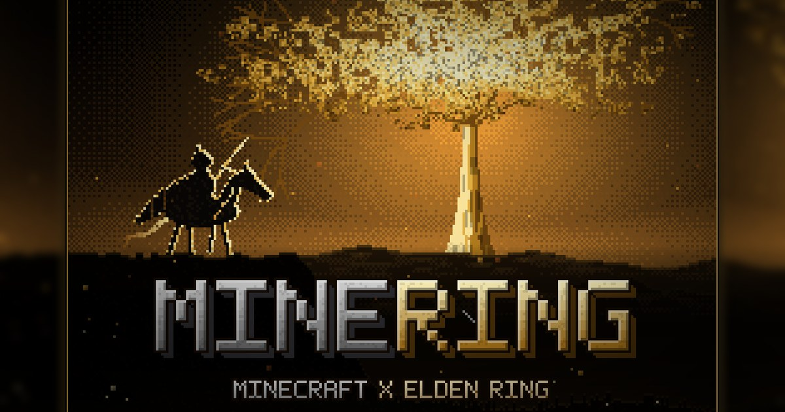

<p align="center">
  <a href="https://minering.franchico.com"></a>
</p>

<h1 align="center">MineRing</h1>

<p align="center">
  <b>Minecraft dentro do Elden Ring, em co-op com um amigo, no Windows.</b><br>
  Feito por <a href="https://www.youtube.com/@franguchico">Franguchico</a>
</p>

<p align="center">
  <a href="https://minering.franchico.com"><b>🌐 Site oficial e download: minering.franchico.com</b></a>
</p>

<p align="center">
  <a href="https://minering.franchico.com"></a>
  <a href="https://github.com/franguchico/MineRing/releases/latest"></a>
  <a href="https://www.youtube.com/@franguchico"></a>
  <a href="LICENSE"></a>
</p>

---

Launcher em pixel art para jogar **Minecraft e Elden Ring juntos**: você controla o corpo do Minecraft dentro do Elden Ring, em co-op com um amigo. Com um clique em **JOGAR** ele confere os preparativos, atualiza o pacote da ponte (com backup), abre o Elden Ring pelo Seamless Co-op (sem anti-cheat) e depois o Minecraft no perfil certo.

| | |
|---|---|
|  |  |
|  |  |

> [!WARNING]
> **Somente offline, sem o Easy Anti-Cheat.** O co-op roda pelo Seamless Co-op, em modo offline. **Nunca** abra o jogo modificado no modo online: você pode ser banido. Use personagens de teste. Projeto de fã, sem garantia, por sua conta e risco.

## Instalação em 3 passos

Você só precisa de Windows 10/11, **Elden Ring na Steam (App Ver. 1.17.1, `eldenring.exe` 2.7.1.0; o launcher não troca a versão)** e Minecraft Java (conta Microsoft). O resto o launcher instala.

1. Baixe o zip pelo site **[minering.franchico.com](https://minering.franchico.com)** (ou na aba [Releases](https://github.com/franguchico/MineRing/releases/latest)) e extraia. O `.exe` e a pasta `pack` precisam ficar lado a lado.
2. Abra `MineRing-Launcher.exe`. Informe os nicks do anfitrião e do convidado, vá na aba **INSTALAR** (ela abre sozinha se faltar algo), marque a confirmação e clique em **INSTALAR TUDO**.
3. Entre com sua conta Microsoft no Prism (o launcher só abre o Prism e explica; nunca vê sua senha) e clique em **JOGAR**.

Os dois jogadores precisam estar na **mesma versão** e usar a **mesma senha do co-op**. Para atualizar, extraia o zip novo por cima e clique em JOGAR: o launcher troca a ponte e o mod sozinho, com backup.

<details>
<summary><b>O que a aba INSTALAR faz, passo a passo</b></summary>

Etapas, com progresso, log e "Tentar de novo" por etapa: conferir PC, Prism Launcher portátil (oficial, 11.1.1, conferido por SHA-256), pacote co-op, ponte no Elden Ring (com backup dos saves), Seamless Co-op v2.0.1 (baixado do release oficial do autor na sua máquina, SHA-256 conferido; se falhar, o launcher vigia a pasta Downloads e aceita o ZIP baixado pelo Nexus), mods Fabric API e e4mc (Modrinth, SHA-256/512 conferidos), perfil do Minecraft 1.21.1 + Fabric. Pode cancelar com segurança; rodar de novo pula o que já está pronto e nunca toca em saves ou mundos. A senha da sessão do co-op é a mesma para os dois (veja "Senha do co-op"); se você não definir uma, o launcher gera uma forte e guarda.

Quem já tinha tudo instalado continua como antes: a aba INSTALAR não muda nada do que já está pronto. O ReShade (opcional, não redistribuído) não é instalado.

</details>

<details>
<summary><b>RODANDO e PARAR</b></summary>

Enquanto o Elden Ring ou o Minecraft estiverem abertos, o launcher mostra o selo **RODANDO** (ou "RODANDO: Elden Ring" / "RODANDO: Minecraft" se só um estiver vivo) e o botão grande vira **PARAR**. Quando os dois fecham, por qualquer meio, ele volta a **JOGAR** sozinho. Se você reabrir o launcher com os jogos já rodando, ele reconhece (Elden Ring/Seamless e o Java do Minecraft/Prism) e também mostra PARAR.

**PARAR** (e o botão **Fechar tudo** do rodapé, que faz exatamente o mesmo) pede confirmação e depois fecha: 1) o Minecraft, pelo `Close-Minecraft.ps1` (o mundo é salvo); 2) o Elden Ring, com o pedido normal de fechar a janela, esperando até ~10 s; só se ele não sair é forçado a fechar. Ao final o launcher confere se os processos realmente sumiram; se algum teimar, mostra qual é e você fecha pelo menu do jogo. Prism e Steam não são fechados. O Elden Ring salva sozinho, mas se puder saia pelo menu do jogo antes.

</details>

<details>
<summary><b>Apelidos (nicks) do anfitrião e do convidado</b></summary>

Nenhum nick ou UUID vem no repositório. Na primeira execução (ou quando o arquivo não existe) o launcher abre uma telinha para digitar o **nick do anfitrião** e o **nick do convidado**. O UUID público de cada um é buscado sozinho na API da Mojang (`https://api.mojang.com/users/profiles/minecraft/<nick>`) e tudo fica salvo apenas no seu PC, em:

`%LOCALAPPDATA%\EldenMinecraftLauncher\players.json` (o nome da pasta de estado continua o antigo de propósito: quem já usava o launcher não perde apelidos, senha nem configurações depois da troca de nome para MineRing)

```json
{ "host": { "nick": "...", "uuid": "..." }, "guest": { "nick": "...", "uuid": "..." } }
```

- Para mudar depois: botão **Editar apelidos** na aba JOGAR (abaixo de "Quem é você?").
- Sem internet ou nick não encontrado: o launcher avisa; deixe o UUID em branco e tente de novo mais tarde, ou cole o UUID à mão na própria telinha.
- Os scripts do pack (`Install-CoopRoleProfile.ps1`, `Select-CoopRoleProfile.ps1`) leem esse mesmo arquivo (parâmetro `-PlayersFile` para outro caminho); a whitelist do perfil de anfitrião é validada contra ele. Os ZIPs de perfil precisam ter sido gerados com os mesmos nicks (`host`/`guest` no manifesto e nome do arquivo `...-Anfitriao-<nick>-Prism.zip`).
- Opções de linha de comando para testes: `--players-file <caminho>` e `--mojang-url <base>`.

</details>

<details>
<summary><b>Senha do co-op</b></summary>

Os dois jogadores precisam usar a **mesma** senha de sessão do Seamless Co-op. No painel **SENHA DO CO-OP** da aba JOGAR você pode **Gerar** uma senha forte (4 palavras + 4 números, fácil de ditar), **Copiar** (a área de transferência é limpa em 45 s), **Mostrar/Ocultar** e **Salvar**. Combinem uma senha, cada um salva no seu launcher.

- Onde fica: só no seu PC, em `%LOCALAPPDATA%\EldenMinecraftLauncher\senha-coop.dat`, protegida pelo Windows (DPAPI, só o seu usuário lê). Nunca vai para o repositório, para o `launcher.log`, nem para a linha de comando dos scripts (eles leem um arquivo temporário que é apagado em seguida).
- Ao salvar, o launcher grava no `SeamlessCoop\ersc_settings.ini` do jogo (campo `cooppassword`) e acerta o registro da instalação (o `Start-Coop` confere o hash desse arquivo). O **JOGAR** regrava a senha salva antes de abrir o jogo e avisa se você mudou o campo e esqueceu de salvar. O Elden Ring precisa estar fechado.
- A aba INSTALAR usa essa mesma senha (vazio = gera uma e guarda). Sem senha salva, o checklist mostra um aviso.
- Quem já tinha o Seamless instalado: a senha que já está no ini é importada na primeira abertura, sem mudar nada no jogo.
- Se você editar o `ersc_settings.ini` à mão, o launcher recusa sobrescrever (o hash não bate mais com o registro); restaure o arquivo ou reinstale o Seamless pela aba INSTALAR.

</details>

<details>
<summary><b>Música</b></summary>

O launcher toca em loop o tema do Elden Ring em 8-bit, embutido no `.exe` (`assets/musica-8bit.mp3`). Tecla **M** silencia. Se o arquivo faltar, o launcher funciona normalmente, sem som.

A faixa é "(8bit) ELDEN RING - Main Theme / Short Version (Chiptune Cover)", do canal *I'm GearRabbit, make Chiptune / 8bit cover* ([YouTube](https://www.youtube.com/watch?v=Kl4-HAepMtM)). Ela pertence ao autor e não está sob a licença MIT deste repositório; será removida a pedido do autor.

</details>

## Para desenvolvedores

- `src/`: o launcher (WPF nativo, C#, compilado com o `csc.exe` que já vem no Windows; nada para instalar).
- `pack/`: código da ponte Elden Ring <-> Minecraft (DLL nativa em C++, mod Fabric em Java) e scripts PowerShell de instalação/atualização. Deriva de [justbustin/minecraft-crossover-bridge](https://github.com/justbustin/minecraft-crossover-bridge) (MIT).
- `assets/fonts/`: fonte Press Start 2P (OFL).

<details>
<summary><b>Compilar, opções de linha de comando e testes</b></summary>

```powershell
powershell -ExecutionPolicy Bypass -File Build.ps1
```

Gera `MineRing-Launcher.exe`. Os binários do `pack` (`erbridge_core.dll`, `dinput8.dll`, `ErmcDepth.addon64`, jar do mod) vêm na Release; para compilá-los veja `pack/EldenMinecraft-Windows/elden-ring/Build-Windows.ps1` (MSVC, JDK 21).

Opções de linha de comando: `--no-intro`, `--no-music`, `--low-fx`, `--dry-run` (simula tudo sem abrir jogos). Para testes: `--sandbox <pasta>` (todo estado, Prism, perfis e pack vão para lá; Steam/Elden simulados por `tools/New-Sandbox.ps1`), `--offline-fixtures <pasta>` (usa arquivos locais com os mesmos hashes, sem rede), `--auto-install`, `--exit-after-install`, `--install-shots <prefixo>`. `tools/Make-Dist.ps1` refaz o zip da Release.

**Teste do PARAR (jogos falsos):** `tools\Test-StopFlow.ps1` roda o launcher em `--sandbox` com `--simulate-games` (jogos FALSOS compilados por `tools\New-FakeGames.ps1`: Elden Ring de mentira, Minecraft de mentira que atende o `quit`, e versões teimosas que ignoram o pedido de fechar), clica JOGAR/PARAR via UI Automation e confere que só os falsos morrem e que os processos reais seguem vivos. Em `--sandbox` o launcher só enxerga processos cujo `.exe` fica dentro da pasta da sandbox.

**Caminho de atualização:** `tools\Test-UpdateKnownHashes.ps1` confere que quem está em qualquer release já publicada consegue atualizar pelo JOGAR. O `tools\Publish-Release.ps1` roda esse teste antes de gerar o zip.

</details>

## Gostou?

Deixe uma ⭐ no repositório (o botão com a foto no canto da janela do launcher abre esta página), conheça o site **[minering.franchico.com](https://minering.franchico.com)** e se inscreva no canal **[@franguchico](https://www.youtube.com/@franguchico)**.

## Créditos

- **MineRing** (launcher, instalador, port Windows e co-op): [Franguchico](https://www.youtube.com/@franguchico).
- Ponte Elden Ring <-> Minecraft original (Mac/CrossOver): [justbustin](https://github.com/justbustin/minecraft-crossover-bridge) (MIT); ideia original de @tobynjacobs.
- Co-op: Seamless Co-op, de LukeYui.
- Fonte: Press Start 2P (SIL OFL 1.1).
- Música: I'm GearRabbit (veja acima), usada com crédito; direitos do autor.
- MinHook (Tsuda Kageyu) e ReShade API (Patrick Mours): veja [THIRD-PARTY-NOTICES.txt](THIRD-PARTY-NOTICES.txt).

Não afiliado a FromSoftware, Bandai Namco, Mojang ou Microsoft. Elden Ring e Minecraft pertencem aos seus donos.

## Licença

[MIT](LICENSE) para o código próprio, Copyright (c) 2026 franguchico (criador do MineRing). A pasta `pack/EldenMinecraft-Windows` mantém a licença MIT original do upstream. Terceiros: [THIRD-PARTY-NOTICES.txt](THIRD-PARTY-NOTICES.txt).
